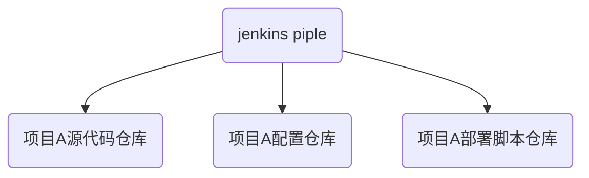
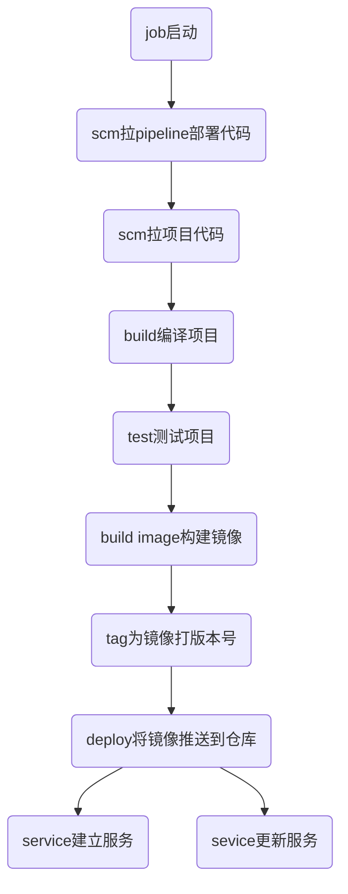

## 项目的持续集成分享
### 源代码管理
* 项目仓库
* 配置仓库
* 发布仓库

### ci/cd相关
* gitlab，管理版本，测试流水线
* jenkins，对项目进行持续集成

### 各模块的关系

### jenkins pipe集成项目的过程

一般我们都是按着上面部署进行项目构建的，像这个JOB执行过程一般由运维人员负责，所以我们会将pipe的核心代码抽象成一个文件，存储在自己的仓库里，由开发人员自己去维护，而运维人员只负责点一下按钮即可。这也就是分离关注点的意思。